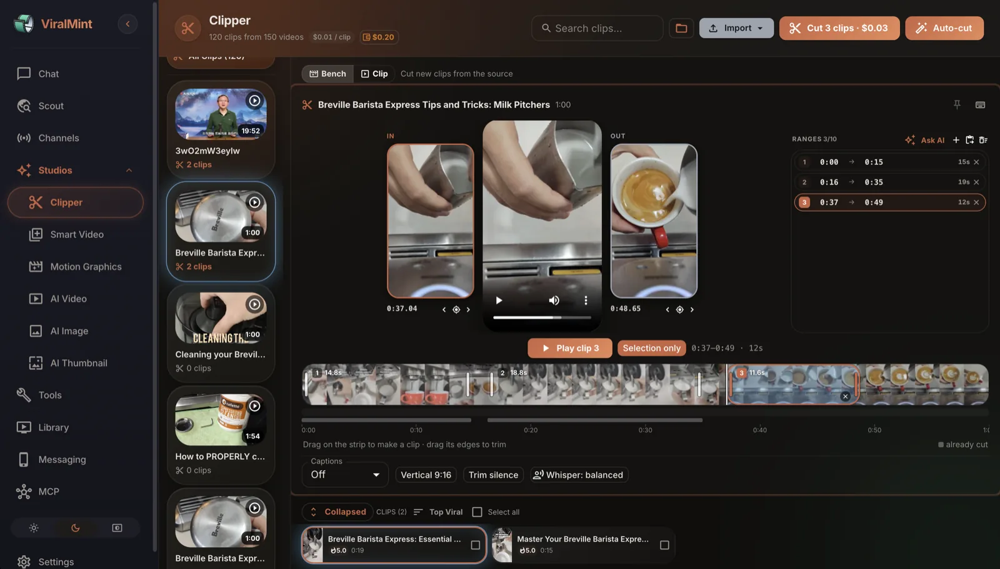
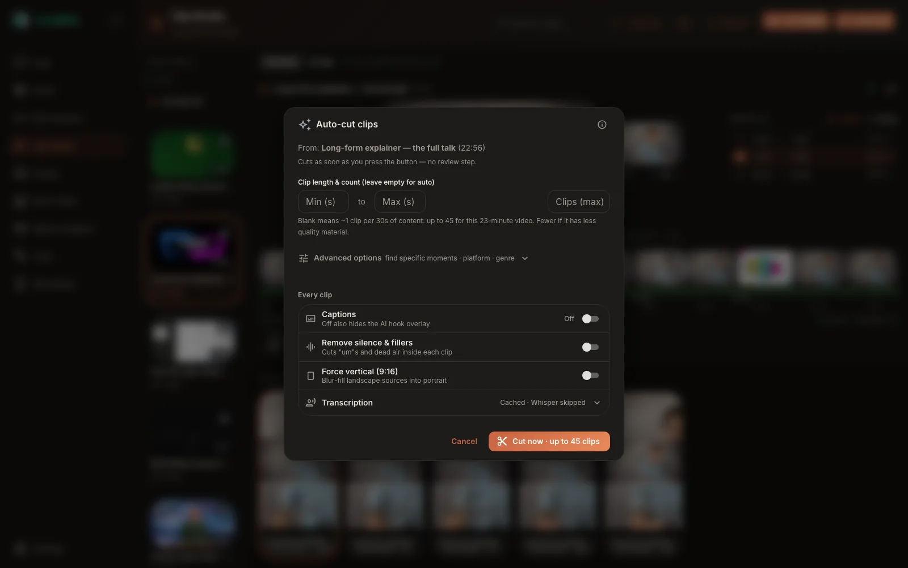
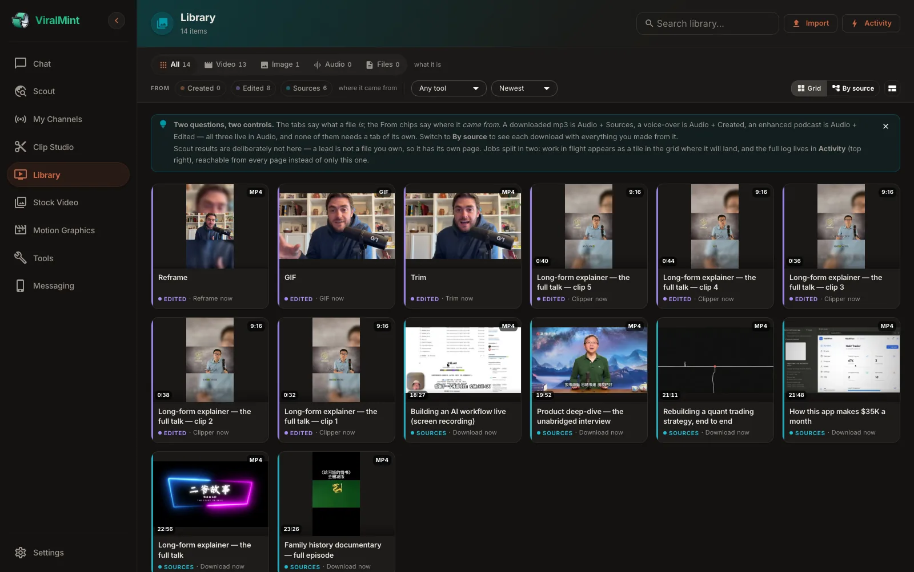
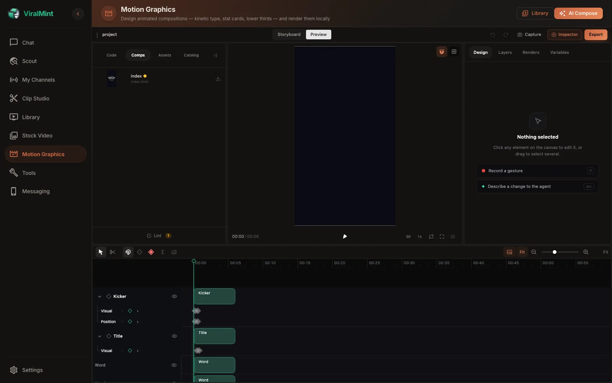
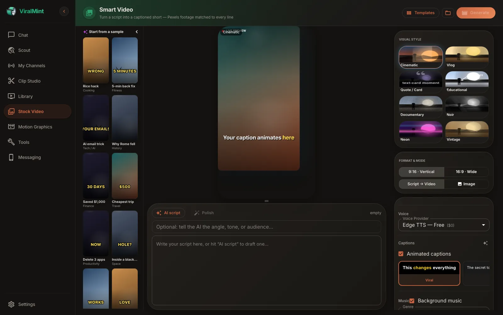
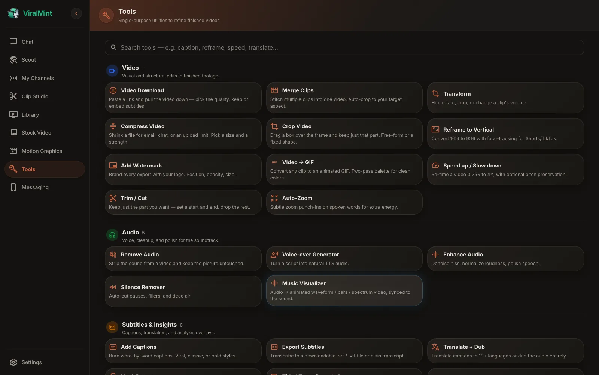
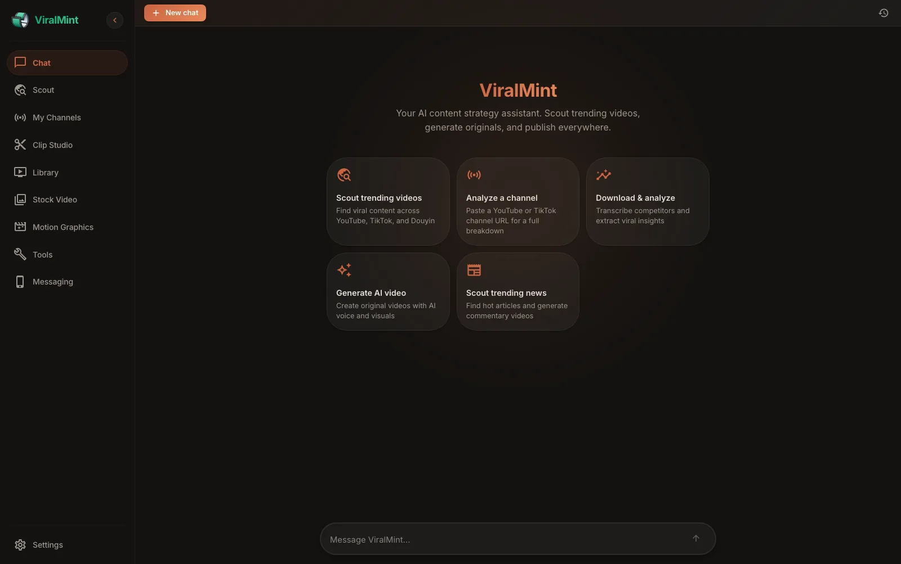
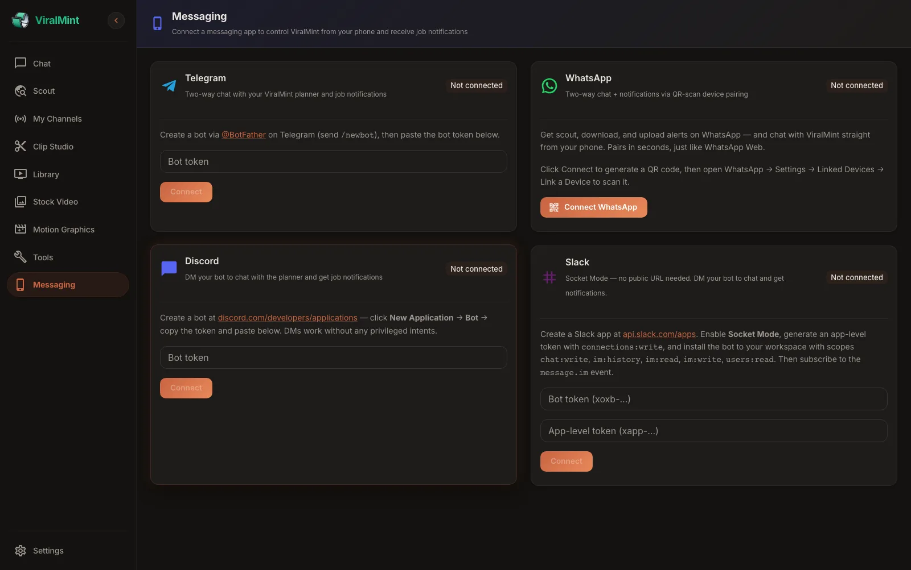

<div align="center">


# ViralMint

### 面向创作者的开源、本地优先视频流水线

**发现趋势 → 切片长视频 → 生成 AI 短视频 → 自动发布到 YouTube 与 TikTok。**
全部在你自己的机器上运行。自带 API 密钥。中间没有任何 SaaS。零遥测。

<!-- Activity badges (top row) — auto-update from GitHub, so they reflect
     real maintenance signal at a glance for awesome-list reviewers and new
     visitors. -->
[](https://github.com/openclaw-easy/ViralMint/stargazers)
[](https://github.com/openclaw-easy/ViralMint/commits/main)
[](https://github.com/openclaw-easy/ViralMint/releases)
[](https://github.com/openclaw-easy/ViralMint/actions/workflows/ci.yml)
[](LICENSE)

[](https://www.python.org/)
[](https://react.dev/)
[](https://fastapi.tiangolo.com/)
[](#-快速开始)

[快速开始](#-快速开始) • [功能特性](#-功能特性) • [免费能力](#-无需-api-密钥即可使用的功能) • [BYOK](#-自带密钥-byok) • [参与贡献](CONTRIBUTING.md)

[English](README.md) · **简体中文** · [日本語](README.ja.md)

<br/>



<sub><i>在真正的时间轴上把长视频切成短视频——在它自己的帧上拖拽、吸附到句子边界，或者让 AI 先提议。发现选题、转写、AI 视频、动态图形与发布，全都在同一个应用里。</i></sub>

</div>

---

> **手动创作者要在十几个标签页和应用之间来回折腾的事，ViralMint 用一条本地工作流全部搞定。**
> 跨 YouTube、TikTok 和抖音发现热门视频，用本地 Whisper 转写并分析，把长视频切成可发布的短视频，用你选择的 AI 撰写原创脚本，渲染带字幕的素材视频——再直接发布到 YouTube 和 TikTok。可以在浏览器里驱动它，也可以在 Telegram、WhatsApp、Discord 或 Slack 上跟它聊。

## ✨ 为什么选择 ViralMint

|   |   |
|---|---|
| 🔒 **100% 本地** | SQLite、本地 Whisper、本地 FFmpeg。你的脚本、转写、下载和生成的视频永不离开你的机器。 |
| 🔑 **BYOK，无中间商** | 使用你自己的 Anthropic / OpenAI / OpenRouter / YouTube / Pexels 密钥，落盘时以 AES-256 加密，直接发往服务提供方——中间没有任何 ViralMint 服务器。 |
| 🤖 **是智能体架构，不是套壳聊天** | 六个各司其职的智能体——Planner、Scout、Download、Analyzer、Generator 和 **Uploader（上传智能体）**——由一个真正会去执行工作的流式 AI 对话统一编排。 |
| 📤 **它替你发布** | 直接上传到 YouTube 和 TikTok，并附带 AI 起草的标题、描述、标签和缩略图。是完整闭环，而不只是生成。 |
| 📱 **用手机随时随地掌控** | 通过 Telegram、WhatsApp、Discord 或 Slack 与规划智能体（Planner）双向对话——任务提醒也发到同一个会话里。 |
| 🆓 **开箱即免费** | 本地 Whisper、Edge TTS（400+ 语音）、免版税音乐、Pexels 素材，以及 22 个 FFmpeg 工具——最重的活儿花费 $0。只为你主动选择接入的 AI 付费。 |

<sub>经过实战检验：一套 **2,300 个测试的 pytest 测试集** 在每次提交时运行，另有一套浏览器测试装置端到端驱动真实应用。AGPL-3.0——尽管 fork、修改，并在其之上创业。</sub>

---

## 🎯 功能特性

<table>
<tr>
<td width="50%" valign="top">

### 🔍 Scout（发现）
跨 **YouTube、TikTok 和抖音**（外加任意 yt-dlp 支持的站点，通过动态搜索）的多平台趋势发现，配合 AI 爆款评分、Google Trends 需求信号、播放增速分析，以及异常值检测（相对频道基线的 3×–20×）。

</td>
<td width="50%" valign="top">

### 🧠 Analyze（分析）
本地 Whisper 转写，长视频也处理得干净利落；外加 AI 洞察提取——钩子、结构、语气、留存风险、建议标题，以及一条可直接运行的复刻提示词——分段级评分，并附上具体的改进建议。

</td>
</tr>
<tr>
<td width="50%" valign="top">

### 🎬 Generate（生成）
完整流水线：AI 脚本 → TTS 配音 → 按关键词匹配的 Pexels 素材 → 感知短语的动态字幕（支持 CJK / 阿拉伯语 / 泰语）→ 音量均衡的背景音乐 → AI 缩略图 → 成品 MP4。

</td>
<td width="50%" valign="top">

### ✂️ Clip Studio（切片工作室）
一条长视频 → 众多可发布的短视频，在**真正的时间轴**上剪。在源视频自己的胶片条上拖拽，拖动手柄时实时看到这一刀的首帧和末帧，切点自动吸附到句子边界，绝不会从半个词开始。可以直接输入精确时间码、粘贴节目笔记里的时间，也可以**让 AI 提议**——它给出的片段会变成可以再调整、可以删除的色块，落地之前什么都不会渲染，并按钩子、流畅度、价值、趋势契合度和传播力打分。赶时间就用 **Auto-cut（一键切）**：一次按下全部搞定，而且会先告诉你这意味着多少条片段。

</td>
</tr>
<tr>
<td width="50%" valign="top">

### 🎞️ Motion Graphics（动态图形）
第三种产出形态，画面里完全没有实拍素材：动态排版、数据卡片、下三分之一字幕条、产品展示。描述你想要的效果，AI 会写出真正的合成工程；再在内嵌的动画工作室里用时间轴、图层和检查器打磨，最后**完全在你自己的机器上渲染**。按需安装——安装包里并不包含它。

</td>
<td width="50%" valign="top">

### 🗂️ Library（素材库）
把你拥有的一切收进一个可筛选的视图——渲染成品、下载、每一个工具的产出、你的音乐目录。两个问题对应两个控件：标签页说明文件**是什么**（视频 / 图片 / 音频 / 文件），标记说明它**从哪来**（生成 / 编辑 / 来源），于是一个下载来的 mp3 不必二选一。切到**按来源**分组，就能看到一条下载和你用它做出的所有东西并排；在任意页面打开 **Activity（活动）** 即可查看正在进行的任务。

</td>
</tr>
<tr>
<td width="50%" valign="top">

### 📤 Publish（发布）
直接上传到 **YouTube**（OAuth）和 **TikTok**（OAuth 或会话 Cookie），并配上按平台优化的标题、描述、标签与缩略图——让一条做好的视频真正被发布出去。

</td>
<td width="50%" valign="top">

### 💬 Chat（对话）
流式 WebSocket 对话，统一编排每一个智能体。说一句 *「去发现做菜的视频」* 或 *「下载这个链接」*，它就直接跑起来。可点按的快捷回复标签、绝不锁住输入框的追问，以及刷新后依然保留的富结果卡片。

</td>
</tr>
<tr>
<td width="50%" valign="top">

### 📲 Messaging（消息）
通过 **Telegram、WhatsApp、Discord、Slack** 从手机双向对话。随时随地指挥规划智能体，并在任务完成时收到提醒——同一个智能体，不同的通道。

</td>
<td width="50%" valign="top">

### ⬇️ 通用下载器
底层由 yt-dlp 驱动——支持 YouTube、TikTok、Bilibili、Instagram、Twitter/X、SoundCloud、Vimeo，以及 **1,800+ 其他站点**。无水印、无广告、不限量。

</td>
</tr>
<tr>
<td width="50%" valign="top">

### 🧰 22 个内置工具
单一用途的小工具——字幕、重构图、GIF、变速、裁剪、字幕文件、水印、合并、自动缩放、音乐可视化、配音，外加 AI 助手（翻译、元数据、钩子分析、自动章节）。**大多数 100% 本地运行于 FFmpeg + Whisper——无需 API 密钥。** 每个都带内嵌的结果预览。

</td>
<td width="50%" valign="top">

### ✨ 主动式助手
对话会读取你的实时流水线——*已下载但未切片*、*已生成但未上传*、*已发现但未下载*——并主动建议价值最高的那一步，而不是干等你开口。

</td>
</tr>
</table>

---

## 🆓 无需 API 密钥即可使用的功能

最烧钱的部分都是免费且本地的。你只为主动选择接入的 AI 付费。

| 功能 | 由谁驱动 | 费用 |
|:--------|:-----------|:-----|
| 从 1,800+ 站点下载视频 | yt-dlp | $0 |
| 音频转写 | 本地 faster-whisper | $0 |
| 配音（400+ 语音，70+ 语言） | Edge TTS | $0 |
| 逐字动态字幕 | FFmpeg + ASS 字幕 | $0 |
| 背景音乐库 | 本地免版税曲库 | $0 |
| 音效自动铺放 | FFmpeg 合成 | $0 |
| 工具：重构图、GIF、变速、裁剪、水印、合并、自动缩放、音乐可视化、字幕文件…… | FFmpeg + Whisper | $0 |

YouTube / TikTok / Pexels 仍需免费的 API 密钥——链接见 [BYOK 章节](#-自带密钥-byok)。

---

## 🚀 快速开始

### 前置依赖

| 工具 | macOS | Linux | Windows |
|:-----|:-----|:------|:--------|
| **Python 3.11+** | `brew install python` | `apt install python3.11` | [python.org](https://www.python.org/downloads/) |
| **Node.js 18+** | `brew install node` | `apt install nodejs npm` | [nodejs.org](https://nodejs.org/) |
| **FFmpeg** | `brew install ffmpeg` | `apt install ffmpeg` | [ffmpeg.org](https://ffmpeg.org/download.html) |
| **ImageMagick** | `brew install imagemagick` | `apt install imagemagick` | [imagemagick.org](https://imagemagick.org/) |

### 安装与运行

```bash
git clone https://github.com/openclaw-easy/ViralMint.git
cd ViralMint

python -m venv venv && source venv/bin/activate     # Windows: venv\Scripts\activate
pip install -r requirements.txt

cp .env.example .env                                  # optional — keys can also be set in the UI
python run.py
```

首次运行会安装前端依赖、构建 SPA、启动 API，并在浏览器中打开 **http://localhost:16888**。

> 💡 **还没有 API 密钥？** 启动后打开「设置 → AI 提供方」，粘贴一个 Anthropic、OpenAI 或 OpenRouter 密钥即可。OpenRouter 是通往 300+ 模型的单一网关——一把密钥就能用上 Claude、GPT、Gemini、Llama 和 Mistral。Edge TTS、Whisper、FFmpeg 和 yt-dlp 无需任何配置即可离线工作。

### 从源码构建桌面应用（可选）

比起终端命令，更想要一个可点击的应用？一套自包含的 PyInstaller 流水线能从这份源码构建出 macOS 的 `.dmg`、Linux 的 `.tar.gz` 或 Windows 的 `.zip`——你的浏览器依然是界面。

```bash
PYTHON_BIN=./venv/bin/python VIRALMINT_VERSION=0.1.0-dev \
  bash desktop/scripts/build-app.sh
```

产物会输出到 `desktop/release/`。首次构建约需 10–15 分钟（PyInstaller 打包是耗时大头）。跳过标志、签名/公证的环境变量以及冒烟测试步骤都写在 **[`desktop/README.md`](desktop/README.md)** 里。

---

## 🔑 自带密钥 (BYOK)

每把密钥都可以在 `.env` *或* 应用内「设置」中按用户设置——谁被设置了就以谁优先。按用户设置的密钥在存储前会经 **AES-256 加密**。密钥直连服务提供方；ViralMint 中间没有任何后端服务器。

| 用于 | 提供方 | 在哪里设置 | 费用 |
|:----|:---------|:------|:-----|
| AI 对话、脚本撰写、分析 | **Anthropic** · **OpenAI** · **OpenRouter** | [console.anthropic.com](https://console.anthropic.com) · [platform.openai.com](https://platform.openai.com/api-keys) · [openrouter.ai/keys](https://openrouter.ai/keys) —— 设置 → AI 提供方 | 按用量付费 |
| YouTube 发现 · 评论 · My Channels | YouTube Data API v3 | [console.cloud.google.com/apis/credentials](https://console.cloud.google.com/apis/credentials) —— 设置 → 服务 API 密钥 | 每天免费 10K 配额 |
| 素材视频 | Pexels | [pexels.com/api](https://www.pexels.com/api/) | 免费 |
| 高级配音（可选） | OpenAI TTS | [platform.openai.com](https://platform.openai.com/api-keys) | 按用量付费 |
| TikTok / 抖音发现 | **TikHub API**（推荐） | [tikhub.io](https://tikhub.io) | 有免费额度 |
| YouTube / TikTok 上传 | OAuth | 设置中一键完成 | 免费 |
| Telegram / Discord / Slack | Bot 令牌 | 设置 → Messaging | 免费 |
| WhatsApp | 扫码配对 | 设置 → Messaging | 免费 |

> ⚠️ **TikTok / 抖音会话 Cookie 发现** 也作为高级兜底方案在设置中提供，但它违反平台的服务条款，而且平台看到「在活动」的正是那把 Cookie 对应的账号。**除非你已明确接受这一风险，否则请使用 TikHub API 路径。** 详见 [LEGAL.md](LEGAL.md#tiktok)。

---

## 🏗️ 架构

```
                     ┌────────────────────────────────────────────────┐
                     │            React 18 + MUI 7 SPA                │
                     │       (served by FastAPI in production)        │
                     │  Chat · Scout · Channels · Library             │
                     │  Stock Video · Clip Studio · Motion Graphics   │
                     │  Tools · Messaging · Settings                  │
                     └─────────────────┬──────────────────────────────┘
                                       │  HTTP + WebSocket
                                       ▼
                     ┌────────────────────────────────────────────────┐
                     │           FastAPI · localhost:16888            │
                     ├────────────────────────────────────────────────┤
                     │  Planner Agent ─── streaming chat + actions    │
                     │  Scout Agent ───── YouTube · TikTok · Douyin   │
                     │                    (+ yt-dlp dynamic search)   │
                     │  Download Agent ── yt-dlp (1,800+ sites)       │
                     │  Analyzer Agent ── Whisper + AI insights       │
                     │  Generator Agent ─ Script → TTS → Stock →      │
                     │                    Captions → Music → MP4      │
                     │  Motion Renderer ─ local HyperFrames engine    │
                     │  Uploader Agent ── YouTube + TikTok OAuth      │
                     │  Messaging ─────── Telegram · WhatsApp ·       │
                     │                    Discord · Slack             │
                     └─────────────────┬──────────────────────────────┘
                                       │
              ┌────────────────────────┼─────────────────────────┐
              ▼                        ▼                         ▼
    ┌─────────────────┐    ┌──────────────────────┐    ┌──────────────────┐
    │  SQLite local   │    │  storage/ on disk    │    │  External APIs   │
    │  (encrypted     │    │  videos · audio ·    │    │  (BYOK, direct)  │
    │   credentials)  │    │  thumbnails · sfx    │    │                  │
    └─────────────────┘    └──────────────────────┘    └──────────────────┘
```

### 技术栈

| 层 | 技术栈 |
|:------|:------|
| **后端** | Python 3.11+ · FastAPI · SQLAlchemy 2.0（异步）· SQLite · WebSockets |
| **前端** | React 18 · Vite · MUI 7 · Zustand · React Router 6 |
| **AI（BYOK）** | Anthropic Claude SDK · OpenAI SDK · OpenRouter（一把密钥用上 300+ 模型） |
| **转写** | faster-whisper（本地、多语言、可感知 GPU） |
| **TTS** | Edge TTS（免费）· OpenAI TTS |
| **视频** | Pexels 素材 · FFmpeg · Ken Burns 图片兜底 |
| **字幕** | FFmpeg + ASS（逐字高亮动画） |
| **下载** | yt-dlp（1,800+ 站点） |
| **消息** | python-telegram-bot · discord.py · slack-sdk · neonize（WhatsApp） |
| **安全** | Fernet（AES-256）加密落盘凭据 |

---

## 📸 界面截图

<table>
<tr>
<td width="50%" align="center" valign="top">
  <a href="docs/screenshots/clipper-bench.webp"></a>
  <sub><b>Clip Studio——剪辑台</b><br/>在源视频自己的帧上拖拽。语音轨、句子吸附、首末帧预览、可直接输入的时间码。按下 Cut 之前什么都不会渲染。</sub>
</td>
<td width="50%" align="center" valign="top">
  <a href="docs/screenshots/auto-cut.webp"></a>
  <sub><b>Auto-cut——快车道</b><br/>信任 AI，跳过复核。按下按钮之前，它会先说明对*这条*视频而言这意味着多少片段。</sub>
</td>
</tr>
<tr>
<td width="50%" align="center" valign="top">
  <a href="docs/screenshots/library.webp"></a>
  <sub><b>Library——你拥有的一切</b><br/>渲染成品、下载、每个工具的产出和音乐目录，统一在一个视图里。标签页说明文件是什么，标记说明它从哪来。</sub>
</td>
<td width="50%" align="center" valign="top">
  <a href="docs/screenshots/motion-graphics.webp"></a>
  <sub><b>Motion Graphics——设计出来的视频，本地渲染</b><br/>动态排版、数据卡片、下三分之一字幕条。AI 写出合成工程，你在时间轴上打磨，最后在自己的机器上渲染。</sub>
</td>
</tr>
<tr>
<td width="50%" align="center" valign="top">
  <a href="docs/screenshots/smart-video.webp"></a>
  <sub><b>Smart Video 工作室</b><br/>脚本 → 配音 → 素材 → 逐字字幕 → 音乐，一次完成。可混入你自己的片段并挑选视觉风格。</sub>
</td>
<td width="50%" align="center" valign="top">
  <a href="docs/screenshots/tools.webp"></a>
  <sub><b>Tools——22 个工具</b><br/>重构图、裁剪、压缩、水印、GIF、变速、裁剪、字幕文件、配音、钩子分析——大多数本地运行，无需 API 密钥。</sub>
</td>
</tr>
<tr>
<td width="50%" align="center" valign="top">
  <a href="docs/screenshots/chat.webp"></a>
  <sub><b>Chat——真正干活的智能体</b><br/>粘贴一个链接、说出一个赛道，或者直接要一条视频。它会调度对应的 agent，并在同一个会话里回报结果。</sub>
</td>
<td width="50%" align="center" valign="top">
  <a href="docs/screenshots/messaging.webp"></a>
  <sub><b>Messaging——用手机指挥它</b><br/>接入 Telegram、WhatsApp、Discord 或 Slack，用同一个智能体干活，并在任务完成时收到提醒。</sub>
</td>
</tr>
</table>

---

## 📁 项目结构

```
ViralMint/
├── run.py                          # 🚀 Single entry point
├── launcher.py                     # System-tray launcher (optional)
│
├── backend/
│   ├── agents/                     # Planner, Scout, Download, Analyzer, Generator, Uploader
│   ├── api/                        # REST + WebSocket endpoints
│   ├── core/                       # AI client, BYOK key resolver, crypto, WebSocket manager
│   ├── messaging/                  # Telegram / WhatsApp / Discord / Slack channels
│   ├── models/                     # SQLAlchemy models
│   └── services/                   # TTS, video gen, captions, music, yt-dlp, Whisper, …
│
├── frontend/
│   └── src/
│       ├── pages/                  # Chat · Channels · Library · Stock Video · Clip Studio · …
│       ├── components/             # Reusable UI (chat, settings, videos, …)
│       ├── hooks/                  # WebSocket, settings, jobs, source video
│       └── store/                  # Zustand global state
│
├── tests/                          # pytest suite (2,300+ tests)
├── storage/                        # Downloaded videos, audio, generated output (gitignored)
│
├── requirements.txt
├── .env.example
├── CONTRIBUTING.md
├── SECURITY.md
└── LICENSE                         # AGPL-3.0
```

---

## 🤝 参与贡献

欢迎提交 Pull Request——修 bug、加新平台、加新消息通道、性能优化、文档，什么都行。请先读 [CONTRIBUTING.md](CONTRIBUTING.md) 了解流程与代码风格，并在提第一个 issue 前查阅 [行为准则](CODE_OF_CONDUCT.md)。

- 📋 **最近变更：** [CHANGELOG.md](CHANGELOG.md)
- 🐛 **报告 bug：** [新建 issue](https://github.com/openclaw-easy/ViralMint/issues/new?template=bug_report.md)
- 💡 **提功能需求：** [新建 issue](https://github.com/openclaw-easy/ViralMint/issues/new?template=feature_request.md)
- 🔐 **安全漏洞：** [SECURITY.md](SECURITY.md)——**请勿** 公开提 issue。

## 📜 许可证与负责任地使用

ViralMint 采用 **GNU Affero 通用公共许可证 v3.0（AGPL-3.0）** 授权（[LICENSE](LICENSE)）。

- ✅ 个人使用、商业使用、修改、再分发均免费
- ✅ 可以在它之上运营 SaaS
- ⚠️ 若你对外分发它（或将其作为公开的网络服务运行），必须以相同的 AGPL-3.0 条款公开修改后的源码

**ViralMint 是一个你在自己机器上运行的工具。** 维护者既不托管你的内容，也不代理你的 API 调用——每一步动作都是你在用自己的平台和密钥亲自完成。使用发现与下载功能前，请先读 [LEGAL.md](LEGAL.md)，弄清楚哪些是被认可的（YouTube Data API、OAuth 上传、Pexels）、哪些是自担风险的（TikTok/抖音会话 Cookie 发现），以及在各平台服务条款下你需要为哪些内容负责。

---

### 🙋 不想自托管？

在 **[viralmint.net](https://viralmint.net)** 也有一个托管版本——同一套「发现 + 分析 + 生成」引擎，已签名并公证，无需接入任何 API 密钥（用预付额度替代 BYOK）。它是闭源的，且不会自动上传——对于宁愿不折腾自己密钥与安装的人，这是另一套取舍。完整对比 + FAQ：**[docs/hosted-vs-self-hosted.md](docs/hosted-vs-self-hosted.md)**。否则，你需要的一切都在这里——继续往下读，然后 `python run.py`。

---

<div align="center">

## ⭐ 如果 ViralMint 对你有用，给它点个 Star

Star 是对这个项目帮助最大的一件事——它能吸引贡献者、解锁 awesome-list 收录资格，也向其他创作者宣告它值得一看。只需一次点击。

**[⭐ 给 openclaw-easy/ViralMint 点 Star](https://github.com/openclaw-easy/ViralMint)**

<!-- Star-history is a LINK, not an embedded , on purpose: GitHub
     restricted the stargazers API on 2026-06-30 (star data is readable
     only by a repo's own admins/collaborators), which broke star-history's
     server-side rendering for public README embeds — the inline SVG now
     returns "rate-limited / not available" for anonymous visitors. A link
     always works and never shows a broken image. If star-history's
     encrypted-token embed becomes viable again, this can go back to a
     <picture> block — but NEVER embed a raw github_pat_ token in the URL
     (it would be public + abused); only star-history's encrypted token. -->
**[📈 查看 ViralMint 的 Star 历史 →](https://star-history.com/#openclaw-easy/ViralMint&Date)**

<br/>

**用 FastAPI、React、Whisper、FFmpeg，以及大量异步 Python 打造。**

项目官网：**[viralmint.net](https://viralmint.net)** · 源码：**[github.com/openclaw-easy/ViralMint](https://github.com/openclaw-easy/ViralMint)** · 许可证：**[AGPL-3.0](LICENSE)**

</div>
</content>
</invoke>
